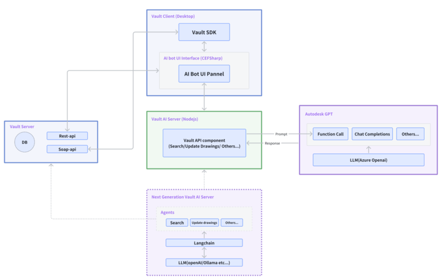

## 系统架构图

这张架构图展示了一个模块化的 AI 驱动系统，它通过在 Autodesk Vault 客户端中集成 AI-Bot，实现更高效的文件管理和操作流程。
Vault AI Server 负责处理主要的业务逻辑，与 Vault Server 通信并通过 API 实现文件操作。
同时，Autodesk GPT 提供了自然语言处理能力，确保用户能够通过简单的自然语言交互高效地使用 Vault 系统。
未来版本的扩展性也体现在 Next Generation Vault AI Server 中，通过引入 Agents 和多模型架构，系统将更加智能化和灵活。

## 系统工作流程

1. 用户输入: 用户在 Vault Client 的 AI-Bot 侧边栏中输入一条自然语言指令。

2. 指令传递: 该指令被发送到 Vault AI Server。

3. 语言模型处理: LLM 负责理解用户的意图，利用 function call 将其转化为具体的操作指令。

4. Vault API 调用: Vault API component 根据 LLM 的指令，调用相应的 Vault API，比如搜索文件、更新属性等。

5. 结果返回: Vault 系统执行完操作后，将结果返回给 Vault AI Server。

6. 生成回复: LLM 根据 Vault 系统返回的结果，生成结果【表格或者人类自然语言】回复，并发送给用户。

## 各模块详细解释

1. Vault Client (Desktop)
    - 用户界面: 这是用户直接交互的部分，包括 AI-Bot 侧边栏面板。用户通过这个面板输入自然语言指令，与系统进行交流。
    - Vault SDK:  Vault 客户端可以使用 Vault SDK 与 Vault Server 进行通信, 提供了与 Vault 系统进行交互的 API 接口，使得插件能够访问
      Vault 中的数据，并执行各种操作。
    - AI Bot Interface (CEFSharp): 提供了一个容器，用于嵌入的浏览器组件（AI Bot UI Panel）。
    - AI Bot UI Panel: AI-Bot 的用户界面，负责展示 AI-Bot 的响应结果，以及提供一些交互选项。

2. Vault AI Server (Nodejs)
    - Vault API component: 这个组件是 AI-Bot 与 Vault 系统交互的核心。它负责将用户的自然语言指令转化为 Vault 系统能够理解的
      API 调用，并把 Vault 系统返回的结果转化为用户易于理解的自然语言。
    - 与 Vault Server 的交互：Vault AI Server 通过 Vault SDK 与 Vault Server 进行通信，获取文件信息、执行操作并将结果返回给客户端。

3. Vault Server (Current use)
    - DB: 存储 Vault 系统中的所有数据，包括文件、元数据等。
    - Rest-api/Soap-api:  Vault Server 通过这些 API 暴露其功能接口，允许外部服务（如 Vault AI Server）调用其功能。AI-Bot
      可以通过这些接口与 Vault 系统进行交互。

4. Autodesk GPT
    - LLM (Azure OpenAI): Autodesk GPT 模块依赖于大型语言模型（LLM），如 Azure 上的 OpenAI，来处理用户的自然语言请求。这个
      LLM 负责生成自然语言响应，并在需要时通过 Function Call 调用具体功能。
    - Function Call: 当用户的请求涉及特定操作时（例如搜索、更新图纸或文件管理），Autodesk GPT 使用 Function Call 将请求转发给
      Vault AI Server 中的相应模块。
    - Chat Completions: GPT 模型负责生成与用户的对话内容，通过自然语言理解（NLU）处理用户请求，并在 AI Bot UI Panel
      中显示自然语言响应。

5. Next Generation Vault AI Server (Maybe replace Vault Server in the future)
    - Agents: 在 Vault AI Server 的下一代架构中，增加了代理模块（Agents），它们可以进一步扩展系统的功能，例如更高级的搜索、自动化图纸更新等。
    - Langchain: 这是一个用于连接不同 LLM 的框架。Langchain 可以将各种语言模型（如 OpenAI、Ollama 等）整合到系统中，提供更复杂的
      AI 推理和功能扩展。通过 Langchain，可以根据不同任务选择最适合的 LLM。
    - LLM (OpenAI/Ollama 等): Vault AI Server 下一代架构中支持多种语言模型，能够根据用户需求动态切换或组合不同的
      LLM，以提供最佳的 AI 服务。

## 未来扩展

未来的 Vault AI Server 架构可能将引入 Agents 和 Langchain（模块 Next Generation Vault AI
Server），以实现更复杂的功能，如智能化的任务自动化、多模型协作等。这将使系统更具扩展性，能够处理更复杂的用户请求。

## Issues
- 关于用户对话的历史记录的存储，是单独的数据库还是直接存储在 Vault Server 中？
- 语言模型的选择，是否需要考虑多种语言模型的组合使用？

## Demo
This demo video shows the interaction between the user and the AI-Bot in the Autodesk Vault client.

[Demo Video](https://myshare.autodesk.com/:v:/r/personal/pengcheng_lu_autodesk_com/Documents/Videos/Clipchamp/Video%20Project%204/Exports/Video%20Project%204.mp4?csf=1&web=1&e=4NK3if)

We can try Vault AI in the cloud environment(10.49.82.190).
Contact @Colin Chen if you want to try it out!

---

This architecture diagram illustrates a modular AI-driven system that integrates an AI-Bot within the Autodesk Vault
client to achieve more efficient file management and operational workflows.

The Vault AI Server handles the main business logic, communicates with the Vault Server, and performs file operations
through APIs.

Meanwhile, Autodesk GPT provides natural language processing capabilities, ensuring that users can efficiently use the
Vault system through
simple natural language interactions.

## System Workflow

1. **User Input**: The user enters a natural language command in the AI-Bot sidebar of the Vault Client.
2. **Command Transmission**: The command is sent to the Vault AI Server.
3. **Language Model Processing**: The LLM interprets the user's intent and converts it into specific operational
   commands
   using function calls.
4. **Vault API Invocation**: The Vault API component executes the corresponding Vault API based on the LLM's command,
   such
   as searching for files or updating attributes.
5. **Result Return**: After the Vault system completes the operation, it returns the results to the Vault AI Server.
6. **Response Generation**: The LLM generates a response (in table format or natural language) based on the results from
   the
   Vault system and sends it back to the user.

## Detail of Each Module

1. **Vault Client (Desktop)**
    - **Vault SDK**: The Vault client uses the Vault SDK to communicate with the Vault Server, providing API interfaces
      to interact with the Vault system, allowing plugins to access data and perform various operations.
    - **AI Bot Interface (CEFSharp)**: Provides a container for embedding browser components (AI Bot UI Panel).
    - **AI Bot UI Panel**: The user interface of the AI-Bot, responsible for displaying the AI-Bot's responses and
      providing some interactive options.

2. **Vault AI Server (Node.js)**
    - **Vault API Component**: This component is the core of the AI-Bot's interaction with the Vault system. It converts
      the user's natural language commands into API calls that the Vault system can understand and translates the
      results back into user-friendly natural language.
    - **Interaction with Vault Server**: The Vault AI Server communicates with the Vault Server via the Vault SDK to
      retrieve file information, perform operations, and return results to the client.

3. **Vault Server (Current Use)**
    - **DB**: Stores all data in the Vault system, including files and metadata.
    - **Rest-API/Soap-API**: The Vault Server exposes its functionality through these APIs, allowing external services (
      like the Vault AI Server) to call its functions. The AI-Bot interacts with the Vault system through these
      interfaces.

4. **Autodesk GPT**
    - **LLM (Azure OpenAI)**: The Autodesk GPT module relies on large language models (LLMs) like OpenAI on Azure to
      process user natural language requests. This LLM generates natural language responses and uses function calls to
      invoke specific functions when needed.
    - **Function Call**: When a user's request involves specific operations (e.g., searching, updating drawings, or file
      management), Autodesk GPT uses function calls to forward the request to the corresponding module in the Vault AI
      Server.
    - **Chat Completions**: The GPT model generates conversation content with the user, processes user requests through
      natural language understanding (NLU), and displays natural language responses in the AI Bot UI Panel.

5. **Next Generation Vault AI Server (Potential Future Replacement for Vault Server)**
    - **Agents**: Represents different functional modules of the AI-Bot, such as search and update.
    - **LangChain**: A framework for building end-to-end language model applications, helping the AI-Bot handle complex
      natural language tasks more efficiently.
    - **LLM (OpenAI, Ollama, etc.)**: Other large language models that can be used as alternatives or for specific
      tasks.

## Future Expansion

The future architecture of the Vault AI Server may introduce Agents and Langchain (modules in the Next Generation Vault
AI Server) to achieve more complex functions, such as intelligent task automation and multi-model collaboration. This
will make the system more scalable and capable of handling more complex user requests.

## Issues
- Storage of User Conversation History: Should the user conversation history be stored in a separate database or
  directly in the Vault Server?
- Language Model Selection: Should the system consider using a combination of multiple language models?